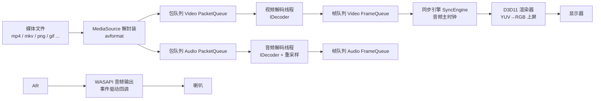

# 00 架构总览

> 本篇是全项目的"地图"。先看懂数据怎么流动，再看任何模块都不会迷路。

## 作用

本文档回答三个问题：

1. 一个媒体文件从磁盘到屏幕/喇叭，中间经历了什么？
2. 项目里有哪些模块，各自负责什么？
3. 为什么要把管线切成这些模块（分层动机）？

## 数据流全景图



一句话版本：

> **解封装线程**把文件切成"包"（Packet），塞进两条有界队列；**解码线程**把包解码成"帧"（Frame），塞进帧队列；**渲染线程**按照**音频主时钟**的节奏把视频帧画到屏幕，**WASAPI 回调**把音频帧送到喇叭。

## 模块职责地图

| 模块 | 目录 | 一句话职责 | 依赖 |
| --- | --- | --- | --- |
| core | `src/core` | 日志、错误、单调时钟、环形队列、通用线程设施 | 标准库 |
| media | `src/media` | 解封装 + 包队列 + 可插拔解码器（软解/硬解） | FFmpeg、core |
| sync | `src/sync` | 音频主时钟、音画同步、变速、丢帧策略 | core、audio 的时钟 |
| audio | `src/audio` | WASAPI 输出、采样率/声道/位深统一、音量 | Windows SDK、media |
| render | `src/render` | D3D11 交换链、YUV→RGB 着色器、帧上屏 | Windows SDK、media |
| player | `src/player` | 编排线程：解封装/解码/渲染的生命周期与主循环 | 以上全部 |
| ui | `src/ui` | Win32 宿主窗口、ImGui 控制面板、`PlaybackController` | player、render |
| api | src/api | 模块接口层：IRenderer/IAudioSink/ISyncEngine 抽象，渲染/音频/同步后端的替换边界 | 标准库、core |

## 分层动机（为什么这样切）

### 1. 每个环节的"时间尺度"不同

- 解封装：毫秒级批处理，一次读一个包，遇到慢盘/网络会阻塞。
- 解码：CPU/GPU 密集，H.264 1080p 每帧可能花 2–8ms，且**不同帧耗时差异很大**（I 帧远慢于 P 帧）。
- 渲染：必须按显示刷新率（60Hz = 16.67ms）节拍进行，不允许被解码拖住。
- 音频输出：硬件回调是**硬实时**的，错过缓冲区期限就会爆音/卡顿。

把它们串成一条同步调用链，任何一个环节抖动都会传导到渲染和音频。**用队列断开同步调用链**，让每个环节只关心自己的节奏，这是整个项目的第一个核心思想。

### 2. 替换成本

渲染后端（D3D11）、音频后端（WASAPI）、解码后端（软/硬）都是**可以独立替换**的。假如不分层，把 `avcodec_send_packet` 直接写进渲染循环，将来接硬解、换 OpenGL，就要重写整个播放器。
接口层（src/api）把这层替换成本显式化：渲染、音频、同步各模块只依赖接口、不引用具体实现类；新增后端 = 新增一个实现类（甚至独立 DLL），编排层零改动。

### 3. 学习价值

ffplay 是 FFmpeg 官方自带的播放器，架构同样是"解封装线程 + 解码线程 + 同步渲染"。本项目相当于**把 ffplay 的核心架构用 C++ 重写一遍**，并且把每一步"为什么"讲清楚。

## 反例对比：如果只有一个线程

伪代码：

```cpp
while (av_read_frame(...)) {
    avcodec_send_packet(...); avcodec_receive_frame(...);
    render_frame(frame);          // 等 16ms
    audio_write(frame);           // 等缓冲区
}
```

问题：

- 遇到 B 帧多的码流，解码一帧要等好几帧输入，画面顿挫；
- 慢盘读取一次 50ms，画面直接卡死；
- 音频写入如果阻塞，错过硬件期限，爆音；
- 视频解码耗时波动没有缓冲吸收，帧率不稳定。

## 边界条件

- 纯音频文件（wav/mp3）：没有视频流，渲染线程退化为"黑屏/海报"，同步引擎只用音频时钟。
- 纯图片（png/jpg/webp）：FFmpeg 把它们也封装成"只有一帧的视频流"，走同一条管线。
- GIF：FFmpeg 的 gif 解码器会按帧延迟产生多帧，天然走视频管线，动画帧率由 pts 驱动。
- 无音频的视频（静音 mp4）：没有音频主时钟，同步引擎回退到单调时钟（按帧率播放）。

## 思考题

1. 为什么音频队列的解码线程和视频队列的解码线程必须分开？合用一个线程会怎样？
2. 为什么帧队列和包队列是两段，而不是解码后直接把帧交给渲染？
3. 如果你要把管线改造成"边下载边播"（流媒体），哪几个模块需要变化，哪几个不用动？

## 模块化（DLL 边界）

- **media_engine.dll**：引擎主体，导出窄 C API（`api/me_api.h` 的 me_* 函数）；UI 只通过它访问播放器；
- **plugin\\1\\decoder_*.dll**：解码器插件（sw / d3d11va），新增后端=新增 DLL；
- **media_player_app.exe**：UI 宿主（Win32 + ImGui），不链接引擎内部；
- 接口版本目录 `plugin\\1\\`：升级插件接口时换目录，避免 ABI 混乱。
