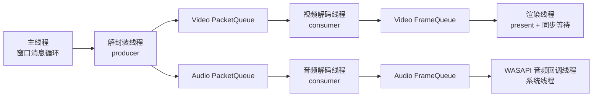

# 01 线程模型与生产-消费者队列

> 本篇是项目并发的核心。理解了"为什么是这些线程、为什么用队列连起来"，就理解了播放器一半的架构。

## 作用

回答三个问题：

1. 项目里有哪些线程，各自干什么？
2. 线程之间怎么通信（生产-消费者队列如何构建）？
3. 队列为什么要**有界**，阻塞与唤醒如何设计？

## 线程清单



| 线程 | 角色 | 节奏 | 结束方式 |
| --- | --- | --- | --- |
| 主线程 | 创建/销毁、消息循环、控制面板 | 事件驱动 | 窗口关闭 |
| 解封装线程 | 读包、投递到两条包队列 | 尽量快，被队列背压限速 | abort 标志 + 队列唤醒 |
| 视频解码线程 | 包→帧 | 尽力而为 | 同上 |
| 音频解码线程 | 包→重采样→写音频环形缓冲 | 跟随硬件节拍 | 同上 |
| 渲染线程 | 按同步引擎节奏上屏 | 60Hz 左右 | 同上 |
| WASAPI 回调 | 从环形缓冲取 PCM 填硬件缓冲 | 硬实时 | 由音频线程拉起/关闭 |

## 生产-消费者队列的构建

这是本项目的核心数据结构，完整实现见 `docs/02-关键数据结构.md`。这里只讲**协议**。

### 队列协议（三个角色）

```cpp
struct BoundedQueue<T> {
    void push(T item);   // 队列满时阻塞；被 abort 时立即返回失败
    bool pop(T* out);    // 队列空时阻塞；被 abort 时返回 false
    void flush();        // 清空队列并"广播"，让 pop 的线程醒来（配合解码器 flush）
    void abort();        // 永久终止：唤醒所有阻塞线程，之后 push/pop 立即失败
};
```

### 为什么 push 要阻塞（背压）

解封装线程的生产速度远快于解码速度（读包几乎是内存拷贝，解码要算几十毫秒）。如果不限速：

- 无界队列会吃光内存（1080p 一小时的 H.264 包约 1–2GB）；
- 播放器看起来"预读"了很多，但 seek 时要全部丢弃，浪费。

**有界队列 + 阻塞 push** 实现了背压（backpressure）：解码跟不上时，解封装线程自然停住；解码追上时，又继续读。整个系统的速率被最慢环节自动钳制。

### 为什么 pop 要阻塞

解码线程无事可做时（读到 EOF、队列空），阻塞等待可以**不占 CPU**。条件变量让线程睡到有数据或被唤醒为止。

### 唤醒与停止（最容易写错的地方）

阻塞在 `pop` 里的线程，如何让它退出？

```cpp
void abort() {
    {
        std::lock_guard lk(mutex_);
        aborted_ = true;
        queue_.clear();
    }
    cv_.notify_all();   // 必须有！否则 pop 永远睡着
}
```

三个要点：

1. 所有状态修改**必须在锁内**，条件变量与锁是一体的；
2. 状态改完**必须 notify_all**，否则没人唤醒；
3. `pop` 必须**循环检查**条件（while 而非 if），防止伪唤醒（spurious wakeup）。

## flush 和 abort 的区别（反例陷阱）

- `flush()`：**临时**复位。seek 时用：清掉旧包，让解码器重新从关键帧开始。队列还能继续用。
- `abort()`：**永久**终止。程序退出时用：之后不再接受任何数据。

写反了会怎样？

- seek 时调 abort：播放器再也无法继续播放；
- 退出时只 flush：阻塞线程可能永远醒不过来，程序无法退出。

## 为什么解封装/解码/渲染必须分线程

反例：单线程顺序播放（见 00 篇）已经分析过卡顿。这里补充**每对生产者-消费者的速率差**：

| 环节 | 平均耗时 | 最坏耗时 | 差值倍数 |
| --- | --- | --- | --- |
| 读一个包 | ~0.01ms | 慢盘 50ms | 5000× |
| 解一帧视频 | 2–8ms | I 帧 30ms | 15× |
| 渲染一帧 | ~1ms | vsync 等待 16ms | 16× |

没有缓冲，任何一个环节的最坏情况都会直接变成画面卡顿。队列本质上就是**给速率波动提供的蓄水池**。

## 边界条件

- 队列已满且 push 阻塞时，flush/abort 必须能打断它（否则 seek/退出卡死）。
- 消费者与生产者对"flush 之后还能不能 push"要达成一致：本项目约定 flush 只清空，不禁止后续 push。
- 多个消费者（本项目每条队列只有 1 个消费者）时，需要额外的"按需分发"逻辑。
- 帧队列的 pop 通常**不阻塞**（见 02 篇），因为渲染线程宁可空等也不肯排队，以便及时响应 seek。

## 思考题

1. 条件变量为什么必须配合 `while` 循环检查，`if` 会有什么 bug？
2. 如果把包队列上限设为 1，会退化成什么效果？上限设为无界呢？
3. 停止播放时，正确的顺序是 abort 队列 → join 线程，还是反过来？为什么？
